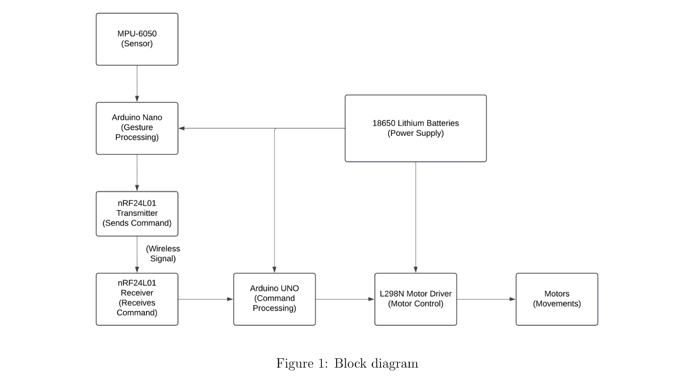

# Hand Gesture Controlled RC Car

This project demonstrates a hand gesture controlled remote control (RC) car using embedded systems and wireless communication. Hand movements are captured using a motion sensor and translated into motor control commands, enabling intuitive and contactless operation of the vehicle.

The project is implemented as a functional proof-of-concept to explore gesture-based human–machine interaction and short-range wireless control.

---

## System Overview

The system consists of two independent units:

### Transmitter Unit
- Uses an MPU6050 accelerometer and gyroscope to capture hand orientation
- Processes sensor data using an Arduino Nano
- Transmits gesture-based commands wirelessly via an NRF24L01 module

### Receiver Unit
- Receives wireless commands using an NRF24L01 module
- Processes commands using an Arduino UNO
- Controls DC motors through an L298N motor driver to drive the vehicle

---

## Working Principle

1. The MPU6050 sensor continuously measures hand motion and orientation.
2. The transmitter Arduino processes this data and maps it to predefined commands such as forward, backward, left, right, or stop.
3. Commands are transmitted wirelessly using NRF24L01 modules operating in the 2.4 GHz ISM band.
4. The receiver Arduino interprets the received command and generates corresponding motor control signals.
5. The L298N motor driver actuates the motors to move the car according to the detected gesture.

A small delay is intentionally introduced in the control logic to reduce gesture noise and ensure smoother motor response.

---

## System Architecture

The block diagram illustrates the flow of data from gesture sensing at the transmitter to motor actuation at the receiver through wireless communication.

---

## Documentation

Detailed documentation is available in the `docs/` directory:

- **System Working:** `docs/System_Working.md`
- **Challenges and Solutions:** `docs/Challenges_and_Solutions.md`
- **Components Used:** `docs/Components_Used.md`
- **Timing Diagram:** `docs/timing_diagram.png`

---

## Design Notes

- The MPU6050 module required manual soldering of header pins before integration to ensure reliable electrical connections.
- NRF24L01 communication stability was improved through power stabilization and RF parameter tuning.
- The project prioritizes reliability and clarity over aggressive performance optimization.

---

## Demonstration and Debugging

System demonstrations and debugging evidence, including gesture-based wheel movement, wireless data transmission, and resolved communication issues—are documented in the repository **Issues** section.

Refer to the issue titled  
**“Demo & Debug Log: Gesture Control and Wireless Data Transmission”** for videos and observations.

---

## License

This project is licensed under the MIT License. See the `LICENSE` file for details.
